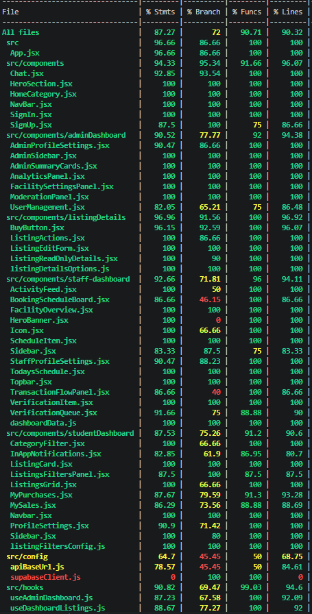
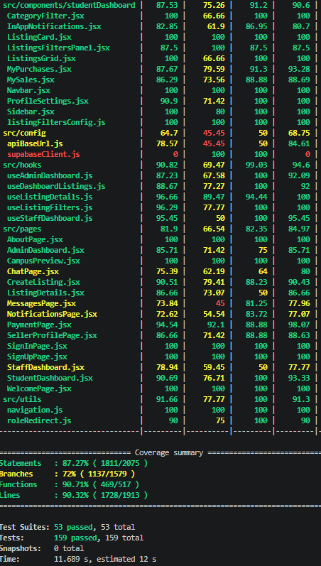

# Test Plan and Results

## Campus Marketplace – UniSquare (Frontend)

**Course:** COMS3009A: Software Design III  
**Group Name:** Dev-astators  

---

## 1. Executive Summary

This document outlines the frontend testing strategy, test coverage, and results for the UniSquare Campus Marketplace application. The frontend follows a **test-driven development (TDD)** approach where unit and component tests are developed alongside implementation for each user story. Testing focuses on page rendering, user interaction, role-based access, state management, and component behavior.

All frontend tests execute automatically through **GitHub Actions** on pull requests and pushes to ensure application stability and prevent regressions.

---

## 2. Testing Strategy

### 2.1 Approach

The frontend project adopts a **Given-When-Then** testing approach for user story validation and component behavior.

| Test Type | Coverage | Tools |
| :--- | :--- | :--- |
| **Unit Tests** | Utility functions and validation logic | Jest |
| **Component Tests** | React component rendering and interaction | React Testing Library |
| **Integration Tests** | Component + API interaction behavior | Jest + RTL |
| **Acceptance Tests** | User story validation | Jest |
| **Continuous Integration** | Automated execution on PR/push | GitHub Actions |

### 2.2 Test Environment

| Component | Configuration |
| :--- | :--- |
| Test Runner | Jest |
| UI Testing | React Testing Library |
| Router Testing | MemoryRouter |
| API Mocking | Jest mocks |
| CI Platform | GitHub Actions |
| Environment Variables | `.env.test` |

---

## 3. User Story Acceptance Tests

### US01: User Sign-In

**Test File:** `Login.test.jsx`

| Test Case | Given | When | Then |
| :--- | :--- | :--- | :--- |
| Login page renders | User visits login page | Component loads | Form fields visible |
| Valid credentials | User enters correct details | Submit clicked | Login request sent |
| Empty fields | Fields left blank | Submit clicked | Validation error displayed |
| Invalid credentials | Wrong email/password | Login attempted | Error shown |
| Loading state | Login in progress | Submit clicked | Loading indicator appears |

---

### US02/US03: Role-Based Dashboard Redirect

**Test File:** `roleRedirect.test.jsx`

| Test Case | Given | When | Then |
| :--- | :--- | :--- | :--- |
| Student login | User role = student | Authentication succeeds | Redirect to student dashboard |
| Facility staff login | User role = facility_staff | Authentication succeeds | Redirect to facility dashboard |
| Admin login | User role = admin | Authentication succeeds | Redirect to admin dashboard |
| Unknown role | Invalid role value | Redirect evaluated | Returns null |
| Missing role | Empty role | Redirect evaluated | Error handled |

---

### US04: Browse Marketplace Listings

**Test File:** `Marketplace.test.jsx`

| Test Case | Given | When | Then |
| :--- | :--- | :--- | :--- |
| Listings render | Active listings available | Marketplace loads | Listings displayed |
| Empty marketplace | No listings | Marketplace loads | Empty state shown |
| Listing cards | Listings loaded | Cards rendered | Correct information displayed |
| Search filter | User enters keyword | Search executed | Matching listings shown |
| Category filter | Category selected | Filter applied | Results filtered |

---

### US05: Student Creates Listing

**Test File:** `CreateListing.test.jsx`

#### Input Validation

| Test Case | Input | Expected |
| :--- | :--- | :--- |
| Valid form | All required fields | Form submits |
| Missing title | Empty title | Validation error |
| Missing category | Empty category | Validation error |
| Negative price | -100 | Validation error |
| Empty description | Blank field | Error shown |
| Invalid condition | Unknown value | Validation error |

#### Submission Behavior

| Test Case | Given | When | Then |
| :--- | :--- | :--- | :--- |
| Student creates listing | Student logged in | Submit form | Listing created |
| Upload images | Images selected | Submit form | Images uploaded |
| Backend error | API failure | Submit form | Error displayed |
| Loading state | Request processing | Submit clicked | Button disabled |

---

## 4. Code Coverage and Test Results Summary

> **Screenshot 1:** Frontend Jest Coverage Report  
> 

> **Screenshot 2:** Frontend Jest Coverage Report  
> 


---

## 5. Component Tests

### 5.1 Navbar Component (`Navbar.test.jsx`)

| Test Case | Given | When | Then |
| :--- | :--- | :--- | :--- |
| Navbar renders | User visits app | Component loads | Navigation visible |
| Logged out state | No session | Navbar loads | Login button visible |
| Logged in state | Active session | Navbar loads | User menu visible |
| Mobile menu | Small screen | Menu clicked | Dropdown opens |

---

### 5.2 ListingCard Component (`ListingCard.test.jsx`)

| Test Case | Given | When | Then |
| :--- | :--- | :--- | :--- |
| Listing exists | Valid listing object | Component renders | Data displayed |
| Missing image | No image available | Component renders | Placeholder shown |
| Click listing | User clicks card | Action triggered | Navigate to details |
| Price rendering | Valid price | Card displayed | Correct formatting |

---

### 5.3 Chat Component (`ChatPage.test.jsx`)

| Test Case | Given | When | Then |
| :--- | :--- | :--- | :--- |
| Existing messages | Chat history exists | Page loads | Messages displayed |
| Send message | User types message | Send clicked | Message added |
| Empty message | Blank input | Submit clicked | Prevent submission |
| Loading messages | API fetching | Component mounts | Spinner shown |

---

### 5.4 CreateListing Component (`CreateListing.test.jsx`)

| Test Case | Given | When | Then |
| :--- | :--- | :--- | :--- |
| Form renders | User visits page | Component loads | Form displayed |
| Image upload | User uploads image | File selected | Preview shown |
| Submit listing | Valid form | Submit clicked | API called |
| Validation failure | Invalid form | Submit clicked | Error displayed |

---

## 6. Service and Utility Tests

### 6.1 Authentication Utilities (`auth.test.js`)

| Function | Test Case | Expected |
| :--- | :--- | :--- |
| Login | Valid credentials | Returns session |
| Login | Invalid credentials | Returns error |
| Logout | Active session | Session cleared |
| Session retrieval | Existing token | User returned |

---

### 6.2 Role Utilities (`roleUtils.test.js`)

| Function | Test Case | Expected |
| :--- | :--- | :--- |
| getRoleRedirect | Admin role | Admin dashboard path |
| getRoleRedirect | Student role | Student dashboard path |
| getRoleRedirect | Invalid role | Null |

---

## 7. Integration Tests

### 7.1 Marketplace Flow (`Marketplace.integration.test.jsx`)

| Scenario | Action | Expected |
| :--- | :--- | :--- |
| Listings retrieved | API success | Marketplace populated |
| API failure | Request rejected | Error displayed |
| Search + filtering | Multiple filters used | Correct results |

---

### 7.2 Messaging Flow (`Messages.integration.test.jsx`)

| Scenario | Action | Expected |
| :--- | :--- | :--- |
| Load chat history | Open conversation | Messages loaded |
| Send new message | User submits | Chat updates |
| API failure | Message rejected | Error shown |

---

### 7.3 Listing Creation Flow (`CreateListing.integration.test.jsx`)

| Scenario | Action | Expected |
| :--- | :--- | :--- |
| Successful submission | Submit form | Redirect to listing |
| API validation failure | Invalid request | Error displayed |
| Upload images | Include image files | Upload successful |

---

## 8. How to Run Tests Locally

Follow these steps to execute the frontend test suite locally:

```bash
# Clone repository
git clone https://github.com/Dev-astators/campus-marketplace.git

# Navigate to frontend
cd campus-marketplace/client

# Install dependencies
npm install

# Run all tests
npm test

# Run specific test file
npm test -- CreateListing.test.jsx

# Generate coverage report
npm run test:coverage

# Run tests in watch mode
npm run test:watch
```

---

## 9. Continuous Integration

Frontend tests are executed automatically through GitHub Actions whenever:

- Pull requests are opened
- Code is pushed to main branches
- New features are merged

The CI pipeline ensures:

- All component tests pass
- User story tests remain valid
- Coverage reports are generated
- Regressions are detected early

---

## 10. Conclusion

The frontend testing suite ensures that all major user interactions, components, and workflows function correctly. Through TDD and automated CI execution, the UniSquare frontend maintains reliability, usability, and consistent functionality throughout development.
